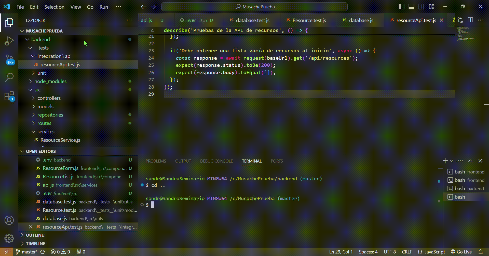

# Desafío Musache Backend

## Requisitos Previos
- Node.js (versión 14 o superior)
- npm (incluido con Node.js)
- Git

Construido Con 🛠️
- Node.js
- Express.js
- 
## ¿Cómo correr el proyecto en local?

### Clona el repositorio
Usa este comando en tu terminal:
```bash
git clone https://github.com/sangaselu/DesafioMusacheBackEnd.git
```
### Ve al directorio del proyecto
Usa este comando en tu terminal:
```bash
cd DesafioMusacheBackEnd
```
### Instalación de dependecias 🔧
Usa este comando en tu terminal:
```bash
npm install
```
## Configura las variables de entorno ⚙️
El proyecto usa variables de entorno para manejar configuraciones como la URL de la API. Copiar el archivo de ejemplo y crea tu archivo .env:
```bash
DB_HOST=xxxx
DB_USER=xxxx
DB_PASSWORD=xxxx
DB_NAME=xxxx
DB_PORT=xxxx
```
## Levanta el servidor de desarrollo 🚀
```bash
npm run dev
```
Luego se abrirá de manera automática en el localhost con su respectivo puerto permitido

# Ejecución de Pruebas 🔩

## Instalar Dependencias de Desarrollo 🔧
```bash
npm install
```
## Ejecutar pruebas ⌨️
```bash
npm test
```
## Ejecución de pruebas ☁️



